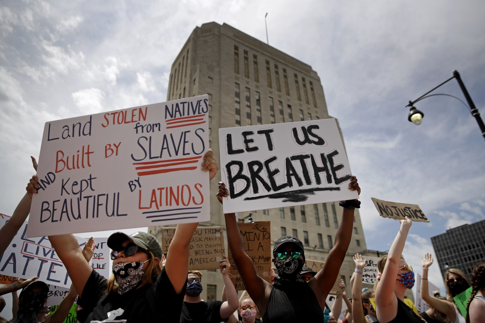

# Assignment 1: Protests
This repository contains code and analysis of protests in the United States, using data from [CountLove](https://countlove.org/).

## Background Research
Before diving into this (or any) dataset, it's important to have _domain familiarity_ (i.e., to know something about the topic). As preparation, you should locate and read _three (3)_ articles about public protests in the U.S.. These can be news articles or more holistic analysis pieces (e.g., as might be in an online magazine or publication).

In this section of the `README.md` file, create an _unordered list_ of the three articles you found. For each article in the list, provide a link to the article (in Markdown formatting, with display text other than the URL) _as well as_ a 1-2 sentence summary or takeaway/thesis from each one.

-[DEMONSTRATIONS & POLITICAL VIOLENCE IN AMERICA: NEW DATA FOR SUMMER 2020](https://acleddata.com/2020/09/03/demonstrations-political-violence-in-america-new-data-for-summer-2020/)

#### This article displays and analyzes data collect regard protests, especially those associated with Black Lives Matter, and levels of violence.

-[Black Lives Matter May Be the Largest Movement in U.S. History](https://www.nytimes.com/interactive/2020/07/03/us/george-floyd-protests-crowd-size.html)

#### This article talks about how the Black Lives Matter movement has differed from its predecessors. Iy also touches on level of participation amongst Americans.

-[Armed protests being planned at all 50 state capitols, FBI bulletin says](https://abcnews.go.com/US/armed-protests-planned-50-state-capitols-fbi-bulletin/story?id=75179771)

#### This article desribes the protests and riots around the U.S. Capitol following President Trump's loss in the 2020 election. It warns of possible state capitol riots and includes the FBI's involvement on the situation.

## Representative Image
A picture is, as they say, worth many words. Images are great at increasing engagement with your analysis as well as conveying the point of your analysis. Find and download at least _one (1)_ image to accompany your analysis, saving the file in the provided `img/` folder in your repo.

In this section of the `README.md` file, display the image from your `img/` folder (remember to use a _relative path_!). Below that image, include 2-3 sentences captioning the image. Your caption should both identify the image as well as explain _why_ you included that image in particular. As practice, use either **bold** or _italic_ text when captioning your image.

#### The image I selected is of a protest regarding racial injustice in Los Angeles, California. **I chose this image as I feel it captures the idea that many Americans protesting are trying to get across.** *That the U.S. has been created by people of all types of backgrounds and that opportunities should be equal for all.*

## Analysis Reflections
As you follow the instructions in the `analysis.R` file, you will be prompted to write six (6) _reflections_ interpreting the results of your code. Those reflections should do in this section.

Each reflection should be about 1-2 sentences long. You can organize the reflections into an _ordered list_ or otherwise label which is which.

1. It means that the majority of the attendances is around the lower and some of the very large protests skew the mean.
2. It does surprise me because as Washington is just 1 of 50 states in the U.S. one might expect a similar proportion of the protests to take place in a single state. However, I do know that Washington is a progressive state and in that sense it does not.
3. There was an issue of there being unique instances of the same state because some were cased differently but, I used the toupper() function to fix this. Also there are some U.S. territories that are not considered states in this data.
4. It does surprise me simply by the amount of it increased but at the same time considering the circumstances of 2020 it makes sense.
5. In July of 2020, HB 6004 was signed in Connecticut and made changes such as altering police training tactics, use of dashboard and body cameras, and many others. In June of 2020, Utah signed HB 5007 which banned the use of chokeholds by police in most situations.
Source: [Changes to policing policy in the states and 100 largest cities, 2020](https://ballotpedia.org/Changes_to_policing_policy_in_the_states_and_100_largest_cities,_2020)
6. It tells me that racial injustice is, by far, the most protested and important issue to the American people within the past 3 years roughly.

## Conclusion
Once you are finished with your analysis (you've completed the `analysis.R` file), fill in this section by answering the following questions (in about 1-2 sentences each):

1. What results from the analysis surprised you? Why?

#### The most surprising data was the amount of protests that came from Washington. I was unaware of level of protests in Washington compared to other states in the U.S.
2. What parts of the analysis did you find most challenging?

#### The most challenging parts were just knowing which functions to use when it wasn't stated in the hint. Also using the correct syntax was often difficult (where to put which arguments, etc.).
3. What kind of analysis do you wish you were able to do with the dataset (but perhaps don't have the technical skills to do so)?

#### I wish I was able to see which protest were directly correlated with policy change as well as which states/regions were most respondent to the protests.